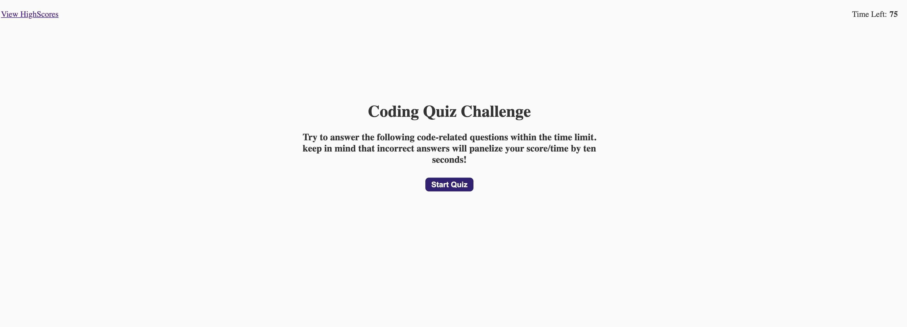
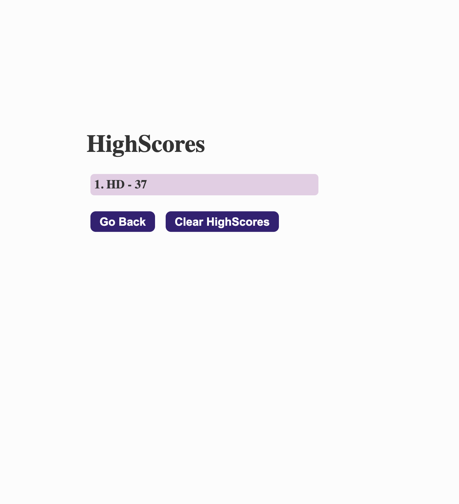

# AssessmentQuiz-

AssessmentQuiz is JavaScript quiz which help you to assess yourself. it is based on timer, on each wrong answer timer will get decrese by 10 count.
users final score will be time left in quiz. Last user will get inputbox to logged initials to record score.
LocalStorage is used to store data. user can see and delete score detail.

Quiz will stop if timers comes to zero or quesions get over.

GitHub Detail - 

It is uploaded in GitHub.

For clone the project use below options or you can download Zip file.

SSH "git@github.com:bhumisha/AssessmentQuiz.git" HTTPS :https://github.com/bhumisha/AssessmentQuiz.git

Project Source code : https://github.com/bhumisha/AssessmentQuiz

You can view and play quiz using below link https://bhumisha.github.io/AssessmentQuiz/

This project includes HTML,CSS and Javascript. main logic is written in javascript. Js file contains DOM manipulation, conditional statements / loop statement /
to modularised code we have used functions. LocalStorage is also used to store score for users.

The following screen demonstrates the application functionality: page by page.
Welcome Page

Quiz Starts

quiz complete and add initials

highscore page
